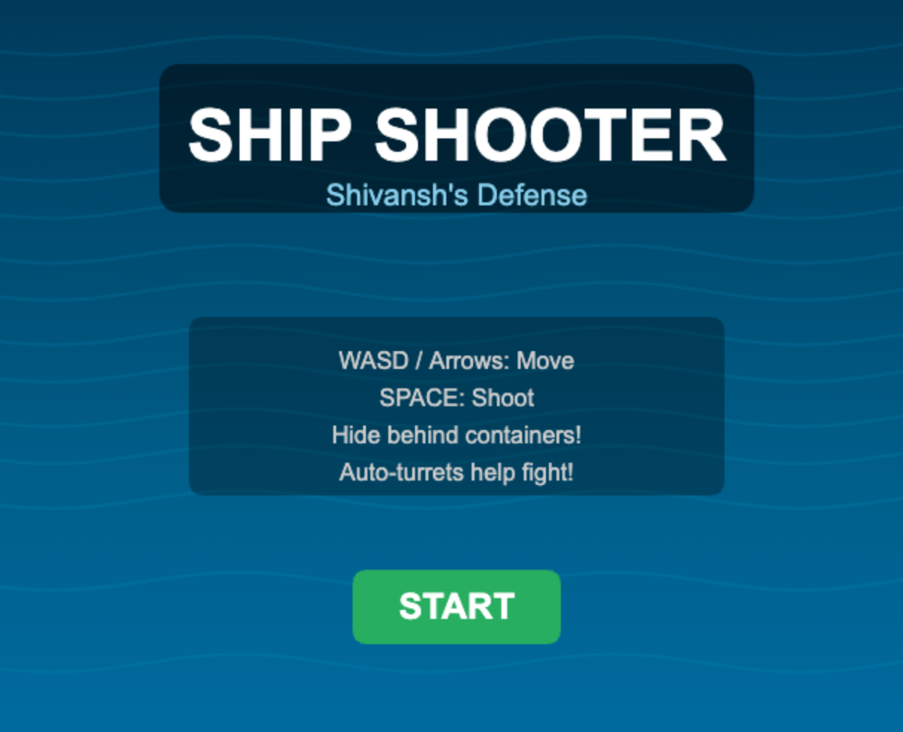
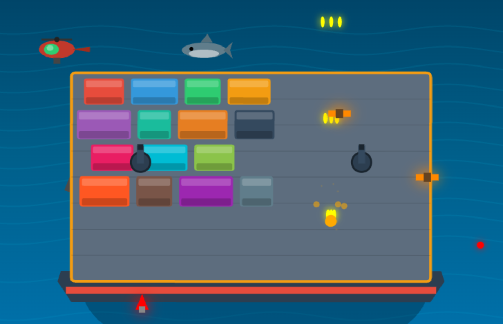

# Ship Shooter - Shivansh's Defense

A 2.5D arcade shooter game where Shivansh defends a cargo ship from attacking helicopters. Built with vanilla JavaScript and HTML5 Canvas.





## Game Overview

**Ship Shooter** is an action-packed arcade shooter where you play as Shivansh, defending a cargo ship sailing through shark-infested waters while enemy helicopters attack from all directions. Use various weapon power-ups, take cover behind colorful shipping containers, and survive as long as possible!

### Features

- **Dynamic Gameplay**: Top-down perspective with scrolling ocean and ship movement
- **Multiple Weapons**: Default triple-shot, AK-47, homing rockets, laser blaster, and EMP
- **Strategic Cover**: Hide behind 15 colorful shipping containers
- **Environmental Hazards**: Sharks that thrash and rock the ship, floating rocks
- **Auto-Turrets**: Two ship-mounted turrets that auto-target enemies
- **Combo System**: Chain kills for bonus points
- **High Score**: Persistent scoring with localStorage
- **Sound Effects**: Web Audio API-generated sound effects for all actions
- **Adaptive Difficulty**: AI director adjusts game difficulty based on player performance
- **Player Name**: Customizable player name for leaderboard
- **Leaderboard**: Top 10 scores with timestamps stored locally

## How to Play

### Controls

| Key | Action |
|-----|--------|
| **W / Arrow Up** | Move forward (up) |
| **S / Arrow Down** | Move backward (down) |
| **A / Arrow Left** | Move left |
| **D / Arrow Right** | Move right |
| **Spacebar** | Fire weapon |
| **P** | Pause game |
| **M** | Toggle sound on/off |

### Game Mechanics

#### Weapons System

When helicopters are destroyed, they drop weapon power-ups:

| Weapon | Drop Rate | Description |
|--------|-----------|-------------|
| **AK-47** | 50% | Rapid burst fire, high accuracy, permanent until death |
| **Homing Rockets** | 35% | 6 rockets that track and destroy helicopters |
| **Laser Blaster** | 10% | 30 seconds of rapid-fire cyan laser bullets |
| **EMP Trigger** | 5% | Instantly destroys ALL helicopters on screen |

#### Health System

- Player has **3 hearts** (health points)
- Getting hit by enemy bullets reduces health
- Invincibility frames after taking damage (flashing effect)
- Game over when health reaches 0

#### Scoring

- **15 points** per helicopter kill
- **+5 bonus** per combo multiplier
- **20 points** per helicopter killed by rocket or EMP
- Combo resets after 1.5 seconds without a kill
- High score saved to localStorage

#### Environmental Hazards

- **Ship Rocking**: Sharks periodically attack and thrash the ship, causing it to rock sideways
- **Waves**: Visual ocean waves with parallax scrolling
- **Rocks**: Floating rocks in the water (visual, no collision)

## Technical Details

### Architecture

```
ship_shooter/
├── index.html      # Complete game (single file)
├── README.md       # This documentation
├── LICENSE         # MIT License
└── .gitignore     # Git ignore file
```

### Game Structure

The game is built as a single HTML file containing:

- **HTML5 Canvas** for all rendering
- **CSS** for basic page styling and canvas centering
- **Vanilla JavaScript** for game logic

No external dependencies required!

### Sound System

All sounds are generated programmatically using the **Web Audio API** - no external audio files needed!

#### Sound Effects

| Sound | Trigger | Type |
|-------|---------|------|
| **Default Shoot** | Player fires default weapon | Short blast |
| **AK-47** | Player fires with AK-47 | Rapid machine gun |
| **Laser** | Player fires with laser | Sci-fi pew |
| **Rocket** | Player fires rocket | Launch whoosh |
| **Turret** | Auto-turrets fire | Sharp shot |
| **Explosion** | Helicopter destroyed | Deep boom + noise |
| **Pickup** | Weapon dropped | Rising arpeggio |
| **Hit** | Player takes damage | Low thud |
| **EMP** | EMP weapon activated | Electric sweep |
| **Click** | UI button clicked | Soft beep |
| **Game Over** | Player dies | Descending jingle |

#### Sound Toggle

- Press **M** to toggle sound on/off
- Sound state is shown in bottom-left corner
- Sound is enabled by default

### Adaptive Difficulty Director

The game features an AI director that dynamically adjusts difficulty based on player performance over a 30-second rolling window.

#### Metrics Tracked
- **Accuracy**: Hits / shots fired
- **Damage Taken Rate**: Health lost per second
- **Kill Combos**: Consecutive kills within 1 second
- **Score Velocity**: Points gained per second

#### Difficulty Adjustment
The director uses exponential smoothing to gradually adjust:
- **Spawn Interval**: How often helicopters appear (50-150 frames)
- **Enemy Density**: Number of helicopters per wave (1-3)
- **Enemy Health**: How many hits to destroy (1-2)
- **Enemy Fire Rate**: How fast enemies shoot (0.3-0.7)
- **Enemy Speed**: Movement speed multiplier (0.7-1.3)

#### Visual Feedback
A difficulty bar on the title screen shows current pressure:
- **Blue**: Easy (player struggling)
- **White**: Balanced
- **Red**: Hard (player dominating)

### Leaderboard System

Top 10 scores are saved locally with timestamps.

#### Features
- Stores player name, score, and date/time
- Persists across browser sessions (localStorage)
- Shows rank, name, score, and when achieved
- Click "SCORES" on title screen to view

### Rendering Layers (Bottom to Top)

1. Ocean background (gradient + animated waves)
2. Rocks (floating in water)
3. Sharks (swimming below ship)
4. Ship hull and deck
5. Shipping containers
6. Auto-turrets
7. Player character
8. Helicopters (enemies)
9. Bullets (all types)
10. Weapon pickups
11. Particles (explosions, muzzle flash)
12. UI overlay

### Game Constants

| Constant | Value | Description |
|----------|-------|-------------|
| `PLAYER_SPEED` | 4 | Player movement speed |
| `BULLET_SPEED` | 14 | Default bullet velocity |
| `TURRET_BULLET_SPEED` | 10 | Auto-turret bullet velocity |
| `ENEMY_BULLET_SPEED` | 7 | Enemy bullet velocity |
| `SHIP_SPEED` | 1.5 | Ocean scrolling speed |
| `MAX_ROCK` | 0.05 | Maximum ship tilt angle |
| `ROCK_DAMP` | 0.94 | Ship rocking damping factor |

### Enemy Spawning

- Base spawn rate: Every 100 frames
- Spawn rate increases with difficulty
- Minimum spawn interval: 45 frames
- Difficulty increases every 15 seconds (900 frames)

### Browser Compatibility

Tested and working in:
- Chrome 90+
- Firefox 88+
- Safari 14+
- Edge 90+

## Installation

### Option 1: Direct Play (Simplest)

1. Download or clone the repository
2. Open `index.html` in any modern web browser

```bash
# Clone the repository
git clone https://github.com/yourusername/ship-shooter.git
cd ship-shooter

# Open in default browser (macOS)
open index.html

# Open in default browser (Linux)
xdg-open index.html

# Open in default browser (Windows)
start index.html
```

### Option 2: Local Server (Development)

For development or if you encounter CORS issues:

```bash
# Using Python 3
python -m http.server 8000

# Using Node.js (npx)
npx serve .

# Using PHP
php -S localhost:8000
```

Then open `http://localhost:8000` in your browser.

## Deployment to GitHub Pages

1. Create a new repository on GitHub
2. Push the project files:

```bash
git init
git add index.html README.md LICENSE .gitignore
git commit -m "Initial commit: Ship Shooter game"
git remote add origin https://github.com/yourusername/ship-shooter.git
git push -u origin master
```

3. Enable GitHub Pages in repository Settings → Pages → Source: master branch
4. Your game will be live at `https://yourusername.github.io/ship-shooter/`

## File Structure for GitHub

### Required Files

```
ship_shooter/
├── index.html          # The complete game (REQUIRED)
├── README.md           # Project documentation (recommended)
├── LICENSE            # MIT License (recommended)
└── .gitignore         # Git ignore file (recommended)
```

### .gitignore Template

```gitignore
# OS files
.DS_Store
Thumbs.db

# Editor files
*.swp
*.swo
.vscode/
.idea/

# Logs
*.log

# Dependencies (if adding)
node_modules/
package-lock.json

# Build outputs
dist/
build/
```

### LICENSE Template (MIT)

```markdown
MIT License

Copyright (c) 2026 Shivansh

Permission is hereby granted, free of charge, to any person obtaining a copy
of this software and associated documentation files (the "Software"), to deal
in the Software without restriction, including without limitation the rights
to use, copy, modify, merge, publish, distribute, sublicense, and/or sell
copies of the Software, and to permit persons to whom the Software is
furnished to do so, subject to the following conditions:

The above copyright notice and this permission notice shall be included in all
copies or substantial portions of the Software.

THE SOFTWARE IS PROVIDED "AS IS", WITHOUT WARRANTY OF ANY KIND, EXPRESS OR
IMPLIED, INCLUDING BUT NOT LIMITED TO THE WARRANTIES OF MERCHANTABILITY,
FITNESS FOR A PARTICULAR PURPOSE AND NONINFRINGEMENT. IN NO EVENT SHALL THE
AUTHORS OR COPYRIGHT HOLDERS BE LIABLE FOR ANY CLAIM, DAMAGES OR OTHER
LIABILITY, WHETHER IN AN ACTION OF CONTRACT, TORT OR OTHERWISE, ARISING FROM,
OUT OF OR IN CONNECTION WITH THE SOFTWARE OR THE USE OR OTHER DEALINGS IN THE
SOFTWARE.
```

## Game States

| State | Description |
|-------|-------------|
| `title` | Title screen with animated background, instructions, and START button |
| `playing` | Active gameplay with all systems running |
| `paused` | Gameplay frozen (press P to toggle) |
| `gameover` | Final score display with PLAY AGAIN option |

## Performance Considerations

- Target: **60 FPS** using `requestAnimationFrame`
- Maximum particles: ~50 active at once
- Maximum enemies: ~20 on screen
- Canvas resolution: 800x720 (responsive)

### Optimization Techniques Used

- Object pooling for bullets and particles
- Array filtering instead of splicing
- Gradient caching (pre-created)
- Minimal DOM manipulation (canvas only)

## Future Enhancements

Potential features for future versions:

- [ ] Sound effects and background music
- [ ] Power-up duration timers visible on screen
- [ ] Mini-map showing enemy positions
- [ ] Multiple ship types to unlock
- [ ] Achievement system
- [ ] Mobile touch controls
- [ ] Two-player co-op mode

## Contributing

Contributions are welcome! Please feel free to submit issues or pull requests.

## Credits

- **Game Design**: Shivansh (the 6-year-old who dreamed it up)
- **Development**: Claude Code (AI assistant)
- **Framework**: Vanilla JavaScript + HTML5 Canvas

## License

This project is licensed under the MIT License - see the [LICENSE](LICENSE) file for details.

---

**Made with love for Shivansh's first game!** 🎮🚀
